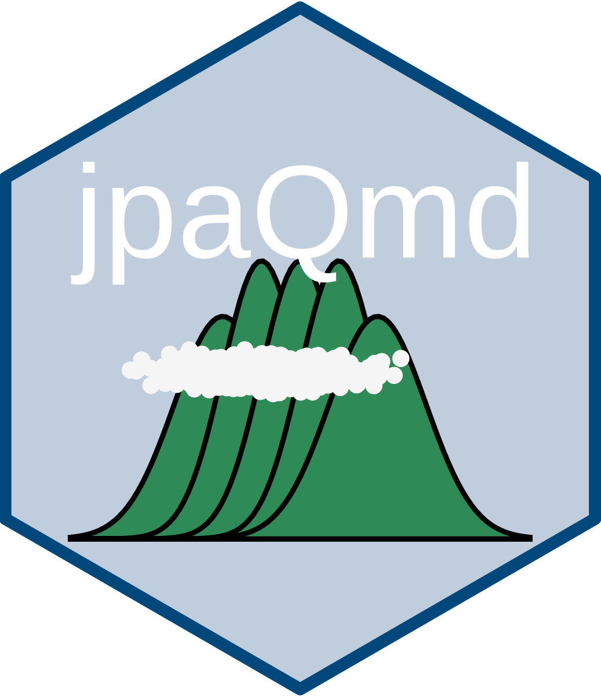

# jpaQmd




jpaQmdは，日本心理学会の『心理学研究』と『Japanese Psychological Research』への投稿用PDF原稿を作成するためのQuarto拡張機能です。[日本心理学会の「執筆・投稿の手びき(2022年版)」](https://psych.or.jp/manual/)に基づいています。おまけで，『心理学評論』のテンプレートも用意しています。どれも完成版ではなく，おそらくある不具合を修正する必要があるかもしれません。不具合があれば，Issuesか国里愛彦(専修大学)に報告ください（メールフォーム，メール，Xなどどこからでも構いません）。本Quarto拡張機能の引用文献処理には，[biblatex-jpa](https://github.com/sbtseiji/biblatex-jpa)を使っています。

本リポジトリには，以下の3つのカスタムフォーマットが含まれています。

| 投稿先 | フォーマット名 | デモqmdファイル |
|---|---|---|
| 心理学研究 | `jjpsy-pdf` / `jjpsy-docx` | `心理学研究.qmd` |
| Japanese Psychological Research | `jpr-pdf` / `jpr-docx` | `Japanese_Psychological_Research.qmd` |
| 心理学評論 | `sjpr-pdf` / `sjpr-docx` | `心理学評論.qmd` |

## インストール法

### 新規プロジェクトを作成する場合

新規にプロジェクトを作る場合は，Terminalなどで以下のように`quarto use template`を実行します。デモqmd・bibliography.bib・拡張機能一式がダウンロードされます。

```bash
quarto use template ykunisato/jpaQmd
```

上記のコマンドを行うと以下の質問がなされます。最初の質問はYesと回答します。２つ目の質問はディレクトリを作ってその中にテンプレートをいれるかどうかを聞いています。既にテンプレートをいれるディレクトリがあり，そこに移動している場合はNoと回答します。Noと回答したらそのままテンプレートがダウンロードされて，３つ目の質問はないです。ディレクトリを新規に作る場合は２つ目の質問でYesとします。すると，３つ目の質問でディレクトリ名を聞かれますので，作りたいディレクトリ名を記入ください。

```
Quarto templates may execute code when documents are rendered. If you do not trust the authors of the template, we recommend that you do not install or use the template.

? Do you trust the authors of this template (Y/n) ›
? Create a subdirectory for template? (Y/n) ›
? Directory name: ›
```

### 既存のプロジェクトに拡張機能だけを追加する場合

既存のQuartoプロジェクトに拡張機能だけを追加したい場合は，以下のコマンドを実行ください。`_extensions/jjpsy/`，`_extensions/jpr/`，`_extensions/sjpr/`がプロジェクトに追加されます。

```bash
quarto add ykunisato/jpaQmd
```

## 使用法

### PDFを出力する

ダウンロード後，使用するqmdファイルを開いて，RStudio等でRenderをクリックすると各誌のフォーマットでPDFが出力されます。コマンドラインから出力する場合は次のようにします。

```bash
quarto render 心理学研究.qmd --to jjpsy-pdf
quarto render Japanese_Psychological_Research.qmd --to jpr-pdf
quarto render 心理学評論.qmd --to sjpr-pdf
```

### Wordを出力する

各qmdファイルのYAMLには `<format>-docx: default` を最初から含めています。Renderすると，PDFと併せてWord文書も出力されます。Wordだけを出力したい場合は次のようにします。

```bash
quarto render 心理学研究.qmd --to jjpsy-docx
quarto render Japanese_Psychological_Research.qmd --to jpr-docx
quarto render 心理学評論.qmd --to sjpr-docx
```

Wordのみで十分な場合は，qmdのYAMLから `<format>-pdf: default` の行を削除しても構いません。

### YAMLヘッダの例

各qmdファイルのYAMLヘッダは以下のようにシンプルになっています。

```yaml
---
format:
  jjpsy-pdf: default
  jjpsy-docx: default
bibliography: bibliography.bib
editor: visual
---
```

オプションを上書きしたい場合は次のように書きます。

```yaml
---
format:
  jjpsy-pdf:
    keep-tex: false
bibliography: bibliography.bib
---
```

## 引用文献スタイルについて

本拡張機能は[biblatex-jpa（日本心理学会風文献スタイル，2022年版）](https://github.com/sbtseiji/biblatex-jpa)の `jpa.bbx` / `jpa.cbx` / `jpa.dbx` を同梱しています。これらのファイルは2026/5/7時点で配布元からダウンロードしたもので，変更は加えていません。

## ライセンス

本リポジトリのライセンスは[LICENSE](LICENSE)を参照ください。同梱しているbiblatex-jpaのライセンスは[配布元](https://github.com/sbtseiji/biblatex-jpa)を参照ください。
