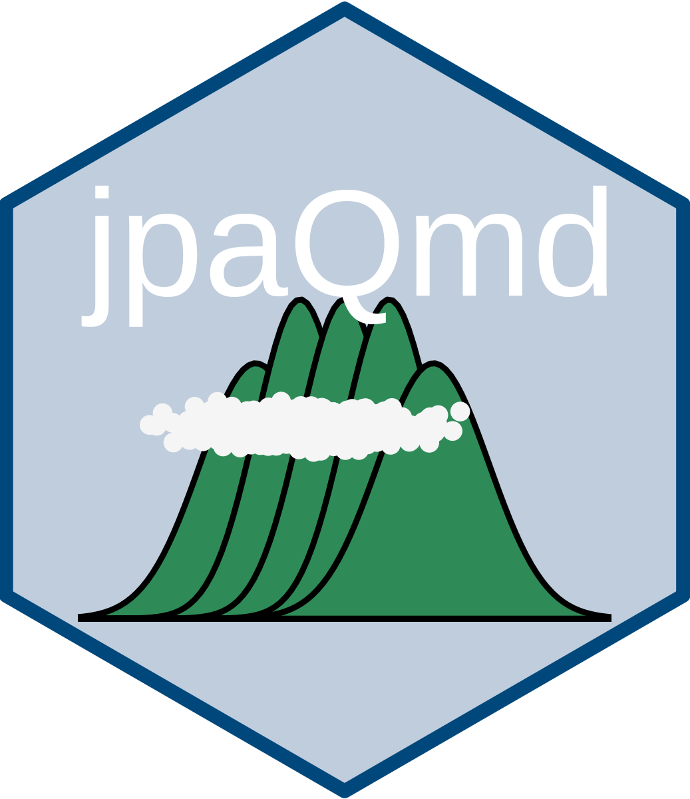

# jpaQmd




jpaQmdは，日本心理学会の『心理学研究』と『Japanese Psychological Research』への投稿用PDF原稿を作成するためのQuartoテンプレートです。[日本心理学会の「執筆・投稿の手びき(2022年版)」](https://psych.or.jp/manual/)に基づいています。おまけで，『心理学評論』のテンプレートも用意しています。どれも完成版ではく，おそらくある不具合を修正する必要があるかもしれません。不具合があれば，Issuesか国里愛彦(専修大学)に報告ください（メールフォーム，メール，Xなどどこからでも構いません）。


## 既存のプロジェクに作成する場合のインストール法

既存のプロジェクに作成する場合は，Terminalなどで以下のようにインストールします。

```bash
quarto use template ykunisato/jpaQmd
```

上記のコマンドを行うと以下の質問がなされます。最初の質問はYesと回答します。２つ目の質問はディレクトリを作ってその中にテンプレートをいれるかどうかを聞いています。既にテンプレートをいれるディレクトリがあり，そこに移動している場合はNoと回答します。Noと回答したらそのままテンプレートがダウンロードされて，３つ目の質問はないです。ディレクトリを新規に作る場合は２つ目の質問でYesとします。すると，３つ目の質問でディレクトリ名を聞かれますので，作りたいディレクトリ名を記入ください。

Quarto templates may execute code when documents are rendered. If you do not trust the authors of the template, we recommend that you do not install or use the template.

- ? Do you trust the authors of this template (Y/n) ›
- ? Create a subdirectory for template? (Y/n) ›
- ? Directory name: ›

なお，quarto use templateを使うと，jpaQmd.Rprojが作られます。

## 使用法

jpaQmdテンプレートをダウンロードすると，以下の３つのファイルがあります。投稿先に応じて，使い分けてください。

- 心理学研究.qmd (『心理学研究』投稿用）
- Japanese_Psychological_Research.qmd (『Japanese Psychological Research』投稿用）
- 心理学評論.qmd (『心理学評論』投稿用）

用いるQuarto(qmd)ファイルを開いて，Renderをクリックください。各雑誌のフォーマットでPDFが出力されます。

## その他

PDFで十分なのですが，どうしてもWordがほしい場合もあるかもしれません。その場合は，以下のコマンドを実施して，Word形式で出力できます(調整が必要です)。

**心理学研究の場合**

```
pandoc 心理学研究.tex -o 心理学研究.docx --reference-doc=template/JJPsy_template.docx -V lang=ja-JP --pdf-engine=lualatex
```

**Japanese Psychological Researchの場合**

```
pandoc Japanese_Psychological_Research.tex -o Japanese_Psychological_Research.docx --reference-doc=template/JPR_template.docx --pdf-engine=lualatex
```

**心理学評論の場合**

```
pandoc 心理学評論.tex -o 心理学評論.docx --reference-doc=template/sjpr_template.docx -V lang=ja-JP --pdf-engine=lualatex
```
